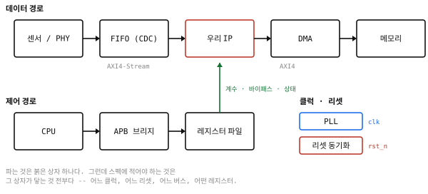
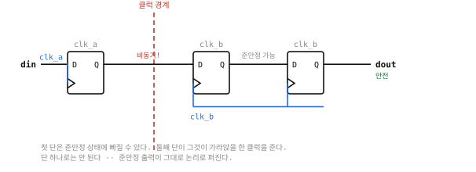
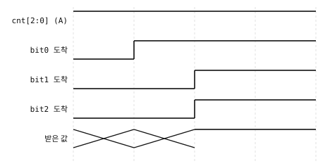
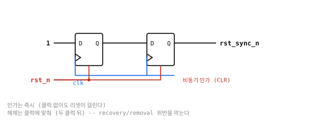
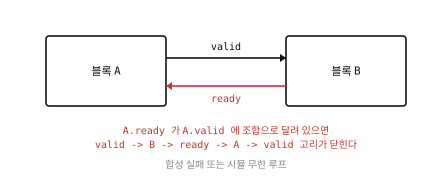
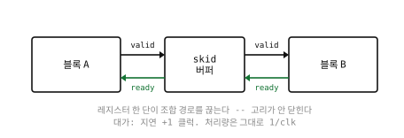
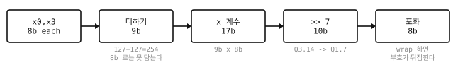
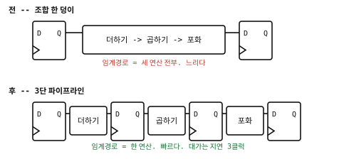

# 13. 설계에서 특히 조심할 여덟 자리 — 그림으로

> **여는 때**: 05단계(RTL)를 시작하기 전에 한 번, 그리고 막힐 때마다.
> **여기 있는 사고는 전부 실제로 난 것이다.**
> 이 여덟 개가 IP 통합 실패의 대부분을 차지한다.

---

## 먼저: 내가 파는 것은 상자 하나지만



1인 하우스가 파는 것은 **붉은 상자 하나**다. 그런데 스펙과 통합 가이드에
적어야 하는 것은 **그 상자가 닿는 것 전부**다.

| 닿는 것 | 스펙에 적어야 하는 것 | 안 적으면 |
|---|---|---|
| 클럭 | 몇 개, 몇 MHz, 어느 엣지 | 고객이 CDC 를 빠뜨린다 |
| 리셋 | 동기/비동기, 극성, 최소 길이 | **블록이 통째로 안 돈다** |
| 데이터 버스 | 프로토콜, 폭, back-pressure 유무 | 안 붙는다 |
| 제어 버스 | APB/AXI-Lite, 레지스터 지도 | 소프트웨어를 못 짠다 |
| 앞 블록 | 무엇을 주나 (형식·단위) | 형식이 안 맞는다 |
| 뒤 블록 | 무엇을 기대하나 | 포화/wrap 결정이 틀린다 |

> **여덟 자리 중 다섯이 "상자 밖" 문제다.** 알고리즘이 아니라 경계에서
> 사고가 난다. 초보가 알고리즘에 시간을 다 쓰고 경계를 대충 넘기는 것이
> 정확히 반대로 하는 것이다.

---

## ① 클럭 도메인 교차 (CDC) — 실리콘에서만 죽는 버그

**시뮬레이션에서 통과하고 실리콘에서 실패하는 버그의 최대 원천이다.**

### 왜 위험한가

플립플롭은 클럭 엣지 근처에서 입력이 바뀌면 **준안정(metastable)** 상태에
빠진다 — 0도 1도 아닌 어중간한 전압에서 한동안 머문다. 다른 클럭에서 온
신호는 언제 바뀔지 모르므로 **반드시** 이 일이 일어난다.

### 막는 법: 2단 동기화기



첫 단이 준안정에 빠져도, 둘째 단이 **그것이 가라앉을 한 클럭**을 준다.

```verilog
// 1비트 신호를 clk_b 영역으로 넘긴다
reg sync1, sync2;
always @(posedge clk_b) begin
    sync1 <= din_from_clk_a;   // 여기가 준안정에 빠질 수 있다
    sync2 <= sync1;            // 가라앉을 시간을 준다
end
wire dout = sync2;             // 이것만 쓴다
```

> **단 하나로는 안 된다.** 준안정 출력이 그대로 논리로 퍼져 여러 곳이
> 서로 다른 값을 본다.

### 더 위험한 것: 다중비트

**동기화기를 비트마다 달면 안 된다.** 각 비트가 서로 다른 클럭에 도착해
**존재한 적 없는 값**이 읽힌다.



`3 (011)` → `4 (100)` 로 바뀌는 순간 세 비트가 동시에 바뀐다. 한 비트만
먼저 도착하면 받는 쪽은 `111 = 7` 을 볼 수도 있다. **3도 4도 아닌 값이다.**

| 넘길 것 | 쓸 것 |
|---|---|
| 1비트 제어 신호 | 2단 동기화기 |
| 다중비트 **카운터** | **그레이 코드** (한 번에 한 비트만 바뀐다) |
| 다중비트 **데이터** | 비동기 FIFO, 또는 handshake + 데이터 고정 |
| 데이터 묶음 | 비동기 FIFO |

**직접 만들지 마라.** CDC 는 검증된 것을 쓴다. 이것이 이 매뉴얼에서
"만들지 말고 가져다 쓰라"고 하는 거의 유일한 항목이다.

### 검증으로는 거의 못 잡는다

일반 시뮬레이션은 준안정을 모델링하지 않는다. 그래서:

* **lint/CDC 검사 도구**로 구조를 본다 (동기화기가 있나, 다중비트인가)
* **설계 규칙**으로 막는다 (도메인 경계를 파일/모듈로 분리)
* 고객이 CDC 도구를 돌릴 것을 가정하고 **도메인 목록을 문서에 적는다**

---

## ② 리셋 — 가장 흔한 통합 실패

### 실제 사고

> HLS 도구가 낸 RTL 을 직접 쓴 테스트벤치에 붙였더니 `done` 이 **한 번도
> 안 왔다.** 400개 벡터가 **400개 다 실패**했다.
>
> 원인: 도구 기본값이 active **low**, 테스트벤치는 active **high**.
> **한 글자 차이.**

그리고 두 번째:

> 리셋 해제 후 한 클럭만 주었더니 **첫 벡터 하나만** 실패했다.
> 나머지 399개는 전부 맞았다. FSM 이 첫 입력을 놓친 것이다.

**전부 틀리면 극성, 하나만 틀리면 타이밍.** 이 구분이 디버그 시간을 반으로 줄인다.

### 세 가지를 반드시 정한다

| 항목 | 선택지 | 스펙에 |
|---|---|---|
| 동기 / 비동기 | 둘 다 쓰인다 | **반드시 적는다** |
| 극성 | active high / low | **반드시 적는다** |
| 최소 유지 | 보통 4클럭 이상 | **반드시 적는다** |

### 비동기 리셋을 쓴다면: 인가는 비동기, 해제는 동기



비동기 리셋의 **해제**가 클럭 엣지 근처에서 일어나면 recovery/removal
타이밍을 위반한다 — 어떤 플롭은 리셋에서 나오고 어떤 플롭은 안 나와서
**상태 기계가 불법 상태로 시작한다.**

```verilog
// 인가는 즉시, 해제는 두 클럭 뒤
reg r1, r2;
always @(posedge clk or negedge rst_n) begin
    if (!rst_n) begin r1 <= 1'b0; r2 <= 1'b0; end
    else        begin r1 <= 1'b1; r2 <= r1;   end
end
wire rst_sync_n = r2;    // 이것을 설계에 쓴다
```

> **초보에게 권하는 것**: 동기 리셋, active high, 최소 4클럭.
> 가장 단순하고 함정이 적다. 비동기가 필요한 이유가 생기기 전까지 쓰지 않는다.

---

## ③ 핸드셰이크 — 조합 고리와 교착

### 하지 말아야 할 것



**`in_ready` 가 `in_valid` 에 조합으로 의존하면 안 된다.**
두 블록을 이으면 `valid → B → ready → A → valid` 로 고리가 닫혀,
합성이 실패하거나 시뮬이 무한 루프에 빠진다.

### 막는 법: skid buffer



레지스터 한 단이 조합 경로를 끊는다. 대가는 **지연 +1 클럭**이고,
**처리량은 그대로 1/clk** 다.

### AXI-Stream 을 쓴다면 반드시 지킬 규칙

```
valid 를 올렸으면, ready 를 볼 때까지 data 를 바꾸지 않는다
valid 를 ready 때문에 내리지 않는다  (교착의 원인)
```

이 규칙을 어기면 **상대 블록이 데이터를 잃는다.** 어서션으로 박아 둔다:

```systemverilog
property valid_stable;
    @(posedge clk) disable iff (rst)
        (tvalid && !tready) |=> $stable(tdata) && tvalid;
endproperty
assert property (valid_stable)
    else $error("tvalid 중에 ready 없이 데이터가 바뀌었다");
```

> **처음이면 back-pressure 없는 스펙으로 시작하라.** `valid` 만 쓰고
> "매 클럭 받을 수 있다"고 적으면 이 절 전체가 필요 없어진다.

---

## ④ 비트 폭 — 조용히 틀리는 자리



### 규칙

| 연산 | 필요한 폭 |
|---|---|
| n비트 + n비트 | **n+1** |
| n비트 × m비트 | **n+m** |
| n개를 누산 | n비트 + ⌈log₂(개수)⌉ |

**127 + 127 = 254 는 8비트 부호있는 수에 안 들어간다.**
8비트로 자르면 **넘칠 때만** 틀린다 — 자극의 몇 %에서만.
무작위 검사가 통과하고, 고객 현장에서 가끔 터진다.

### C++ 쪽 함정: 정수 승격

```c
int8_t a = 100, b = 100;
auto c = a + b;      // c 의 타입은 int8_t 가 아니라 int. 값은 200
```

C 가 `char`·`short` 를 전부 `int` 로 올린다. 그래서 **모델은 안 넘치고
RTL 만 넘친다.** 증상은 "가끔 1 틀림" 이고, 이것이 몇 주를 먹는다.

**고치는 법**: 넓은 폭에서 계산하고 **마지막에 한 번** 포화한다.

### 포화냐 wrap 이냐 — 뒤 블록이 정한다

| | 넘칠 때 | 뒤에 판정기가 있으면 |
|---|---|---|
| **wrap** | 감아 돈다. +127 → −128 | **부호가 뒤집혀 정반대로 판단한다** |
| **포화** | 한계에 붙는다 | 크기는 틀려도 **부호는 맞다** |

wrap 은 공짜(배선만)이고 포화는 비교기 둘 + mux 가 든다.
**그런데 그 값이 어디로 가는지가 결정한다.** 비싸다고 wrap 을 고르면 안 된다.

---

## ⑤ 임계경로 — 빠르게 만드는 유일한 방법



**임계경로 = 가장 느린 레지스터-레지스터 경로.** F_max 를 정하는 그것.

끊는 자리를 고를 때:

1. 합성 보고에서 **가장 긴 경로**를 찾는다
2. 그 경로의 **중간**에 레지스터를 넣는다
3. 다시 잰다. 다른 경로가 임계가 됐을 수 있다

| 얻는 것 | 잃는 것 |
|---|---|
| 주파수 | 지연(클럭 수) 증가 |
| | 레지스터 면적 |
| | 제어 논리가 복잡해진다 (valid 도 같이 밀어야 한다) |

> **실측**: 같은 필터가 조합 한 덩이일 때 47 MHz, 3단 파이프라인일 때
> 77 MHz 였다. **1.6배**. 면적은 252 → 256 LC 로 거의 안 늘었다
> (레지스터가 FPGA 에서 LUT 와 같이 들어 있기 때문).

### 주파수를 잴 때 — 이것을 빠뜨리면 10배 틀린다

> **실측**: 어떤 블록을 껍데기 없이 쟀더니 **455 MHz**. 씨앗을 바꿔도
> 안정적이었다. 타이밍 껍데기를 씌우고 다시 재니 **47 MHz**.
>
> 도구가 **레지스터 사이 경로만** 재기 때문이다. 진짜 데이터패스는
> 제약 없는 I/O 경로에 있었다.

**알아채는 법**: 레지스터를 **더 넣었는데 주파수가 떨어지면** 거의 확실히 이것이다.
레지스터가 늘어 느려질 수는 없다.

---

## ⑥ 초기화되지 않은 상태 (X 전파)

시뮬레이션에서 `x` 가 보이면 **좋은 일이다.** 문제를 알려 주는 것이다.
진짜 위험한 것은 `x` 가 안 보이게 만드는 것이다.

| 하는 짓 | 결과 |
|---|---|
| 모든 레지스터에 리셋을 건다 | 안전하지만 면적·리셋 팬아웃이 커진다 |
| 데이터패스는 리셋 안 걸고 **제어만** 건다 | 실무 관행. 단 **문서에 적는다** |
| `initial` 로 초기화한다 | **FPGA 는 되고 ASIC 은 안 된다** |
| `x` 를 `0` 으로 강제한다 | **하지 마라.** 진짜 버그가 숨는다 |

```verilog
always @(posedge clk) begin
    if (rst) begin
        state <= IDLE;        // 제어: 반드시 리셋
        valid <= 1'b0;        // 제어: 반드시 리셋
    end else begin
        state <= next_state;
        valid <= in_valid;
        if (in_valid)
            data <= in_data;  // 데이터: 리셋 안 함 (valid 가 0 이면 안 읽힌다)
    end
end
```

**데이터를 리셋 안 하려면 `valid` 가 그것을 가려 준다는 것을 보장해야 한다.**
그 보장이 없으면 리셋한다.

---

## ⑦ 관찰 가능성 — 안 보이는 것은 검증이 안 된다

### 실제 사고

> 8b/10b 부호기의 변이 점수가 **71.4%** 였다. 탈출 중 하나:
> `out_valid <= valid & ~err` 를 `|` 로 바꾼 변이가 통과했다.
>
> 그 변이는 **노는 사이클에 출력이 유효하다고 거짓말한다.** 그런데
> 테스트벤치가 `valid=0` 구간을 **한 번도 안 밟았다.**
> 노는 사이클 관찰 네 줄을 넣자 **100%** 가 됐다.

### 두 번째 사고

> 상태를 가진 블록(running disparity)을 검사하는데 출력에 그 상태를
> 안 실었다. 그러면 **상태 기계가 틀려도 출력 값이 우연히 맞는 경우**를
> 못 잡는다.

### 규칙

| 무엇 | 어떻게 |
|---|---|
| **내부 상태**를 출력에 싣는다 | 검증용 포트를 두거나, 계층 참조로 본다 |
| **노는 사이클**을 관찰한다 | `valid=0` 일 때 출력이 유효하면 안 된다 |
| **오류 신호**를 낸다 | 조용히 이상한 값을 내지 않는다 |
| **사이클 수**를 센다 | 값만 보면 느려지는 결함을 못 잡는다 |

> **변이 점수가 이것을 찾아 준다.** "검사가 통과하나" 가 아니라
> **"검사가 무나"** 를 묻기 때문이다.

---

## ⑧ 범위와 문서 — 기술이 아니라 사업의 실패

앞의 일곱은 기술이다. 이것은 **1인 하우스가 실제로 망하는 방식**이다.

| 증상 | 결과 |
|---|---|
| 기능이 하나씩 붙는다 | 완성이 계속 2주 뒤가 된다 |
| 문서를 마지막에 몰아 쓴다 | 왜 그렇게 정했는지 이미 잊었다 |
| 안 되는 것을 안 적는다 | 고객이 발견 → **그 뒤로 안 산다** |
| 검증을 "나중에" | 팔 수 있는 상태가 영영 안 된다 |

**금요일 15분 범위 점검**([11_하루일과.md](11_하루일과.md))이 이것을 막는다.

---

## 여덟 자리 점검표 — RTL 을 다 쓴 뒤 한 번

- [ ] ① 다른 클럭에서 오는 신호가 있나? 전부 동기화기를 지나나?
      다중비트를 비트마다 동기화하지 않았나?
- [ ] ② 리셋의 동기/비동기·극성·최소길이를 스펙에 적었나?
      비동기면 해제를 동기화했나?
- [ ] ③ `ready` 가 `valid` 에 조합으로 달려 있지 않나?
- [ ] ④ 모든 중간 폭이 충분한가? 포화/wrap 을 **뒤 블록을 보고** 골랐나?
- [ ] ⑤ 주파수를 **타이밍 껍데기 씌우고** 쟀나? 씨앗 셋으로?
- [ ] ⑥ 제어 레지스터가 전부 리셋되나? 데이터는 `valid` 가 가려 주나?
- [ ] ⑦ 내부 상태가 출력에서 보이나? 노는 사이클을 관찰하나?
- [ ] ⑧ 안 만든 것을 `KNOWN_ISSUES.md` 에 적었나?

---

## 다음

→ [05_RTL.md](05_RTL.md) 로 돌아가 쓴다. 또는 [06_검증.md](06_검증.md).

> 더 알고 싶으면: 교재 Part X3(CDC), Z17.5(클럭과 타이밍),
> Z18.4(`=` 와 `<=`), Z16.7(폭이 왜 그 값인가), Z15.3(타이밍 껍데기).
